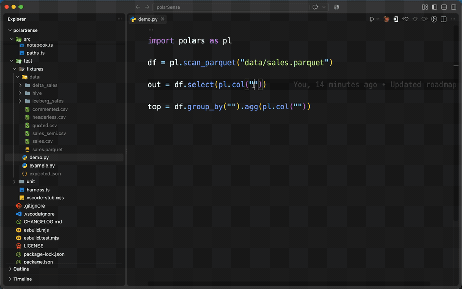

# PolarSense



Column-name autocompletion for [polars](https://pola.rs), pandas and duckdb, read
from the file your DataFrame actually comes from.

```python
import polars as pl

df = pl.scan_parquet("data/sales.parquet")
out = df.select(pl.col("re␣"))
#                      ◆ region      str
#                      ◆ revenue     f64
#                      ◆ returns_qty i32
```

Column names are strings, so no type checker can see inside them. But the schema is
sitting in the file on disk — a parquet footer, a CSV header row, an Arrow IPC
footer, a Delta commit log, an Iceberg metadata pointer, an xlsx header row.
PolarSense reads it and
offers the names.

It never imports polars, never spawns a Python interpreter, and never runs your
code. It reads bytes out of your data files and nothing else — and by default only
the metadata part of them. One feature reads the rows themselves, and it is off
until you [turn it on](#values-if-you-ask-for-them).

## What it completes

Column names inside string literals, wherever polars expects one:

- `pl.col`, `pl.exclude`, `pl.struct`, `pl.concat_str`, and the aggregate shortcuts
  (`pl.sum("x")`, `pl.first("x")`, …)
- `select`, `with_columns`, `drop`, `filter`, `explode`, `unique`, `drop_nulls`
- `sort`, `top_k`, `bottom_k`, `group_by`, `agg`, `partition_by`, `group_by_dynamic`
- `join` and `join_asof` — including `right_on=`, which completes from the frame
  being joined in rather than the receiver
- `rename` and `cast` dict keys, `pivot`, `unpivot`, `over`, `sort_by`
- `df["region"]`, `df[["a", "b"]]`, `get_column`, `get_column_index`, `drop_in_place`
- `polars.selectors` — `cs.by_name`, `cs.exclude`, `cs.starts_with`, `cs.ends_with`,
  `cs.contains`
- `df.filter(region="EU")` and `df.remove(…)` — polars' constraint keywords, the
  one column position that is not inside a string
- `pl.col("address").struct.field("␣")` — a struct's own fields, as deep as they
  go, and `df.unnest("␣")`

### Values, if you ask for them

Everything above reads *metadata*. Turn on `polarsense.values.enable` and a
second family of positions starts answering — the ones holding a value of a
column rather than the name of one, where what belongs is data:

```python
df = pl.scan_parquet("data/sales.parquet")
df.filter(pl.col("region") == "␣")     # US, EU, APAC — read out of the file
df.filter(region="␣")                  # the same, on a constraint keyword
df.filter(pl.col("region").is_in(["␣"]))
df.filter(pl.col("region").str.contains("␣"))   # and starts_with, ends_with
```

This is the only feature here that reads the rows of your data file, which is why
it is off until you turn it on — from settings, or with *PolarSense: Turn on value
completion* in the command palette. It reads one column of the first
`values.maxRows` rows — parquet is columnar, so that is one column chunk rather
than a scan — and caches the answer against the file's mtime like a schema.

It stays quiet more often than it speaks, on purpose:

- More than `values.maxDistinct` distinct values (50) offers **nothing**, not a
  truncated list. A hundred of four million order ids is a claim about how many
  there are, and a false one.
- Columns whose values aren't strings offer nothing — a value position is always
  inside quotes, where a number would be the wrong literal.
- A read that didn't cover every row marks each item `value (sampled)` and says
  how many rows it saw.
- Hive partition columns are exact and free: `region=EU/`, `region=US/` *are* the
  values, read from the directory names with no data touched at all.
- `contains`, `contains_any` and `find` match a **regex** unless you pass
  `literal=True`. Nothing is escaped on the way in, so a value holding `.` or `(`
  arrives as a pattern that means something else — take those as a starting point
  to trim, not a finished argument.

Values are never typo-checked and never hovered. They're data; the file has no
opinion about which of them you meant to type.

And the same wherever pandas or duckdb expects one:

- `groupby`, `sort_values`, `set_index`, `merge`, `drop(columns=…)`,
  `rename(columns={…})`, `astype`, `dropna(subset=…)`, `drop_duplicates`,
  `nlargest`, `value_counts`, `pivot_table`, `query`
- duckdb's relational API — `project`, `order`, `aggregate` — on a relation from
  `duckdb.read_parquet(…)` or from SQL:

```python
import duckdb

rel = duckdb.sql("SELECT * FROM 'data/sales.parquet'")
rel.project("␣")             # completes, and the path in the SQL is ctrl-clickable

df = rel.df().groupby("␣")   # a duckdb relation converted to pandas keeps its schema
```

Column names complete inside the SQL too, in duckdb and in polars:

```python
df.sql("SELECT ␣ FROM self")                        # the frame it was called on
pl.sql("SELECT ␣ FROM df")                          # a frame named in the file
pl.SQLContext(sales=df).execute("SELECT ␣ FROM sales")
duckdb.sql("SELECT s.␣ FROM 'sales.parquet' s")     # an alias picks its table
```

The statement is scanned, not parsed: literals and comments are masked out, then
whatever follows `FROM` and `JOIN` is a table. So `con.execute("SELECT * FROM
users")` names no file and stays quiet, a table name or a quoted path offers
nothing, and a join offers both sides' columns marked as a guess — which side a
bare name belongs to is not something this can know.

Column names are propagated through transformations, so what you are offered is
what actually exists at that point in the chain:

```python
narrow = df.select("region", "revenue").rename({"revenue": "rev"})
narrow.select("␣")           # region, rev — not the other seven columns

joined = a.join(b, on="region")
joined.select("␣")           # both frames' columns, collisions suffixed _right

df.group_by("region").agg(pl.col("revenue").sum()).select("␣")   # region, revenue

df.select(cs.numeric()).select("␣")          # revenue, units — the numeric ones
df.select(cs.starts_with("re")).select("␣")  # region, revenue

df.unnest("address").select("␣")             # the struct's fields, in its place
df.unpivot(index=["region"]).select("␣")     # region, variable, value

nulls = df.null_count().transpose(
    include_header=True, header_name="column", column_names=["null_count"]
)
nulls.select("␣")            # column, null_count — the names the call itself gave
```

Selectors narrow rather than stopping the analysis: `cs.numeric()`, `cs.string()`,
`cs.temporal()` and the other dtype groups are matched against the dtypes already
read from the file, the name-based selectors against the names, and `|`, `&`, `-`
and `^` compose two selectors the way polars composes them.

The status bar shows how many columns the frame at the cursor has. Clicking it —
or **PolarSense: Show schema** — lists them with their dtype and statistics, and
picking one writes it at the cursor:

```
sales.parquet · 7 columns
  region       str    min APAC · max US · no nulls
  revenue      f64    min 12.5 · max 9930.0 · 3 nulls
  order_date   date   min 2026-01-02 · max 2026-06-30 · no nulls
```

Hover a column name for its dtype, the file it comes from, and whatever statistics
that file records — for parquet, null count, min and max, read from the same footer
as the schema:

> **region** · `str`
>
> min `APAC` · max `US` · no nulls
>
> _data/sales.parquet · 3 rows_

**PolarSense: Show details** puts the same facts in a panel beside your code, with
a row per column instead of a tooltip for one:

```
sales.parquet · df
1,048,576 rows · 9 columns · 24.1 MB · 8 row groups · zstd

Column       Type   Nulls   Min         Max
region       str    0       APAC        US
revenue      f64    3       12.5        9930.0
order_date   date   0       2026-01-02  2026-06-30
```

It reads nothing the completions have not already read — every number there comes
out of the parquet footer — so it opens on a four-million-row file as fast as on a
small one, and it never opens by itself. What the footer cannot give is left out
rather than estimated: no distinct counts, no mean, no quantiles. A CSV, which has
no footer, gets the list of names and no statistics columns at all.

**PolarSense: Show data (reads rows)** opens the file itself, a hundred rows at a
time, with the row index and the header row pinned in place:

```
values.parquet · df
200 rows · 4 columns · 1.7 KB · 1 row group · zstd

‹ rows  rows ›   rows 0–99 of 200    ‹ columns  columns ›   [filter columns]

 #   region  order_id   revenue  empty
 0   APAC    ord-0000   0        null
 1   APAC    ord-0001   1        null
```

**Click a column header to sort by it** — once for ascending, again for
descending, a third time for the file's own order back. That is the one thing a
page cannot answer on its own: row 0 of a sorted file is not a row you can seek
to, so the rows have to be in hand before the first one is known. It reads up to
`polarsense.sort.maxRows` (100,000) rows of the columns on screen plus the one
being sorted by, orders them and pages that — and when the file has more rows than
that, the panel says *sorted over the first 100,000 of 4,000,000 rows* rather than
letting the top of a window read as the top of the file. Values sort as what they
are, so `199` lands above `99`, and empty cells go last in both directions.

The page on screen is the read. Only the rows of that page and only the columns
being drawn are fetched — parquet keeps columns apart, so forty of five thousand
costs forty — and nothing is cached afterwards. A wide frame is navigated rather
than rendered: forty columns at a time, stepped with `columns ›` and narrowed
with the filter box.

Rows come from parquet and CSV. A CSV has no footer to say where row 5,000 begins,
so its rows are read out of the same bounded prefix the header comes from and the
panel says that is what you are looking at. Arrow IPC, Delta and Iceberg show their
schema and say plainly that their rows are not read yet.

### Opening a `.parquet` file

Click one in the explorer and you get that table, instead of *"The file is not
displayed because it is either binary or uses an unsupported text encoding"*:

```
sales.parquet
1,048,576 rows · 9 columns · 24.1 MB · 8 row groups · zstd

‹ rows  rows ›   rows 0–99 of 1,048,576   ‹ columns  columns ›   [filter]  [Details] [Graph]
```

It is the same grid with no code behind it, which makes it the simplest thing in
the extension: a file has no transforms applied and nothing inferred about it, so
there is nothing for the header to warn about and no cursor to resolve. The two
buttons at the end of the bar open the details panel and the graph on that same
file. Rewrite the file from a script while the tab is open and it redraws itself,
because a row count read when you opened it is a fact about a file that is no
longer there.

The tab is read-only in the strong sense — it is registered as a read-only custom
editor, so there is no save path to reach. To get VS Code's own editor back for one
file use *View: Reopen Editor With…*; for all of them, set:

```jsonc
"workbench.editorAssociations": { "*.parquet": "default" }
```

**PolarSense: Show graph (reads rows)** draws the shape of a column instead of
listing it:

```
values.parquet · df
200 rows · 4 columns · 1.7 KB · 1 row group · zstd

x [ region ▾ ]   y [ none ▾ ]              chart [▁▄█] [⋰] [╱]   [⤓]

rows
100 ┤ ███
 60 ┤ ███  ███
 40 ┤ ███  ███  ███
    └──US───EU──APAC──
             region
```

Which chart you get is a lookup over dtypes, not an inference engine: one numeric
column is a histogram, one column of labels is a bar of counts, a date against a
number is a line, two numbers are a scatter, and labels against a number are a bar
of means — with `count`, `sum`, `mean`, `median`, `min` and `max` a pick away, and
the axis naming which, because a bar of means and a bar of totals look identical
and answer different questions. A date against a column of labels is one line per
label, counting the rows at each point of the axis — up to six, coloured, with a
legend. A date column also carries a `by` picker — year, month, week, day, hour,
minute, second — which moves every row to the start of its period before grouping,
so `sum revenue by month` is two picks. Periods are cut on UTC and a week starts on
Monday. A numeric column with a dozen values
or fewer is drawn as bars rather than binned. The two pickers sit above the plot and
the chart type sits at the other end of the same row — a row of icons, one per
chart, of which only the ones those columns can actually be are shown — so a
default that is wrong costs one click.

At the end of that row is a **download button**, which writes the chart on screen
to a PNG where you choose. What comes out is the plot — marks, axes, gridlines,
captions and the legend where there is one — at twice its drawn size and on the
panel's own background, so a dark theme's chart is not grey marks on
transparency when it lands in a document. The suggested name says which frame and
which columns, `values-region-revenue.png`, rather than `chart.png`. The header
above the plot is not in the picture: the file name, the row counts and the notes
are what the panel says *about* the frame, not part of the chart.

**The rows never reach the panel.** Bins are counted in the extension and a
histogram of four million rows is thirty numbers, which is what crosses. It reads
at most `polarsense.graph.maxRows` rows of the one or two columns being drawn, and
says so in a note above the plot when that was less than the file. There is no filter,
no grouping by more than one column, and no second series: this answers *what does
this column look like*, and a question past that one is a query you should write.

When a graph is opened on a frame a notebook cell **computed** — a `group_by`, a
join, a new column — the values it draws come from that cell's running kernel
rather than the file behind the frame. It reads the frame the cell already
printed, so nothing re-runs, and `dt_mean`, `dt_median` and `count` draw the
numbers you actually calculated instead of columns the file does not hold. This
is the one place PolarSense runs Python: it is read-only, opt-in through
`polarsense.graph.useKernel`, and asks your consent the first time. With the
setting off, no kernel running, or a plain `.py` file, the graph falls back to
the source file and says the transforms were not applied — the file path is
never taken away.

In a notebook, all three panels are a click away from the output itself. A cell
ending in a frame gets a small bar under what it printed:

```
   shape: (200, 4)
   ┌────────┬──────────┬─────────┐
   │ region ┆ order_id ┆ revenue │
   └────────┴──────────┴─────────┘

   POLARSENSE  [ Details ]  [ Data ]  [ Graph ]
```

No kernel is needed to *find* the frame — the one exception is graphing a
computed frame, above, which reads the kernel for its values. The button says
which output was clicked; the cell's own source says which frame that is, and PolarSense already
knows which file is behind it — so the buttons work on a notebook you have opened
but never run, on a frame defined eight cells earlier. A cell whose frame is built
in memory rather than read from a file says so instead of opening a panel.

Carrying a button under an output means registering a renderer for `text/html`,
and VS Code has no supported way to *add* to the built-in HTML renderer — so
PolarSense stands in its place for every HTML output in the notebook, not only
for frames. It draws them the way the built-in renderer does, scripts and all. If
anything renders differently with PolarSense installed, that is a bug worth
reporting. `polarsense.notebook.buttons` turns the bar off and leaves the
rendering as it is.

Column names that do not exist are flagged as you type, with a one-click fix:

```python
df.select("regoin")
#          ~~~~~~   No column "regoin" in this frame. Did you mean "region"?
```

The check only speaks when it is sure. If anything between the file and the cursor
could not be modelled — an unmodelled reshape, a selector it cannot read, a frame
it could not identify, a file it could not read — it stays silent rather than
guessing. A diagnostic that cries wolf gets switched off and never switched back
on. It also stays silent inside `cs.starts_with("reg")` and its siblings, where
the string is a fragment of a name and was never meant to be a whole one.

A frame built in another file is followed too — the import is resolved and that
file is read the same way:

```python
# loaders.py
def load_sales():
    return pl.scan_parquet("data/sales.parquet").select("region", "revenue")

# report.py
from loaders import load_sales
load_sales().select("␣")     # region, revenue — the narrowing survives the import
```

`import loaders` with `loaders.sales`, relative imports, packages and aliases all
work. Only modules the open file actually imports are read, two hops out — nothing
in `site-packages`, and nothing indexed in the background. A function returning a
frame resolves the same way inside a single file. Turn it off with
`polarsense.followImports`.

When a path genuinely cannot be read — it arrives as a function parameter, a
config attribute, an environment variable — a comment can name it:

```python
# polarsense: data/sales.parquet
return pl.scan_parquet(cfg.source_path)

def report(df):        # polarsense: data/sales.parquet
    df.select("␣")     # completes
```

The comment governs the statement it is attached to, trailing on the line or alone
on the line above, and on a `def` it answers for that function's parameters. It is
consulted last, so a path the extension can work out for itself always wins and a
stale pragma cannot override working code. The format comes from the extension —
a bare directory is read as parquet, and Delta or Iceberg tables say so outright:
`# polarsense: delta data/warehouse/sales`.

It finds the frame by tracking assignments within the file:

```python
df     = pl.scan_parquet("data/sales.parquet")
recent = df.filter(pl.col("date") > cutoff)   # alias — same schema
joined = recent.join(dim, on="region")        # still the same schema
joined.select("␣")                            # completes
```

Paths do not have to be literals. Module constants, `+` concatenation, f-strings
without interpolation, `Path(...) / "file.parquet"` and `os.path.join(...)` are all
folded down to a path before the file is opened. Relative paths are tried against
the file's own directory, then each workspace folder, then `polarsense.pathRoots`.

The path a runnable script actually uses is folded too:

```python
df = pl.scan_parquet(Path(__file__).parent / "sales.parquet")
df.select("|")               # completes — the file beside this one
```

`Path(__file__).parent` is the file's own directory, which is the first place a
relative path is looked for anyway, so the two spellings find the same file —
except only this one still runs from another working directory. `.parent.parent`
climbs, `.resolve()` and `os.path.dirname(os.path.abspath(__file__))` fold the
same way, and a bare `__file__` — a file, not a directory — is left alone.

Globs and directories resolve to the first matching file, and `key=value` directory
segments are added as hive partition columns, the way polars adds them.

## Formats

| Format | How the schema is read |
| --- | --- |
| Parquet | Footer only — two range reads, independent of file size; struct columns keep their fields |
| CSV | Header row, honouring `separator`, `has_header`, `skip_rows`, `comment_prefix`, `quote_char`, `new_columns` |
| Arrow IPC | The schema flatbuffer — out of the footer for a file, out of the first message for a stream; struct columns keep their fields |
| Delta | `_delta_log` walked newest-first to the most recent `metaData` action, falling back to the checkpoint parquet when the commits have been vacuumed |
| Iceberg | `metadata/version-hint.text` → the current schema in that metadata file |
| JSON / NDJSON | The first 50 objects of a bounded prefix read; keys unioned in first-seen order, dtypes from the values themselves, nested objects keep their fields |
| Excel | The header row, out of the `.xlsx` zip — `sheet_name=`/`sheet_id=` resolved through `workbook.xml`, shared strings resolved, skipped cells named rather than closed up |

Values — when `values.enable` is on — come from parquet only, plus hive partition
directory names. Rows and graphs come from parquet and CSV. Opening a data file as a
table is offered for `.parquet` and `.pq` alone — the two extensions where rows
are fully readable and where VS Code has nothing of its own to show.

Schemas are read when a file opens rather than when you first ask for a column, so
the first completion is a cache hit. They are cached on the file's mtime and size,
and a rewritten file invalidates itself.

Notebooks are supported: every code cell above the cursor is treated as one module,
so a frame defined in cell 1 completes in cell 8.

## Settings

| Setting | Default | What it does |
| --- | --- | --- |
| `polarsense.enable` | `true` | Turn completions off without uninstalling |
| `polarsense.pathRoots` | `[]` | Extra directories to try for relative paths |
| `polarsense.fallbackToAllSchemas` | `true` | When the frame can't be identified, offer every schema in the file |
| `polarsense.maxColumns` | `5000` | Cap on items offered for one schema |
| `polarsense.csv.sniffBytes` | `262144` | How much of a CSV to read looking for the header |
| `polarsense.csv.inferDtypes` | `false` | Guess CSV dtypes from the first rows |
| `polarsense.followImports` | `true` | Follow imports into other files in the workspace |
| `polarsense.https.enabled` | `false` | Allow reading schemas over `https://` |
| `polarsense.cacheSize` | `200` | File schemas held in memory |
| `polarsense.values.enable` | `false` | Offer real values from your data. **Reads rows, not just metadata** |
| `polarsense.values.maxRows` | `10000` | Rows of one column to read when offering values |
| `polarsense.values.maxDistinct` | `50` | Above this many distinct values, offer none |
| `polarsense.sort.maxRows` | `100000` | Rows to read when a column header is clicked to sort. A bigger file is sorted over its first `sort.maxRows` rows, and the panel says so |
| `polarsense.graph.maxRows` | `100000` | Rows to read when drawing a graph. Only the columns drawn are read, and only the bins cross to the panel |
| `polarsense.graph.useKernel` | `true` | In a notebook, read a computed frame's real values from the running kernel so a graph shows the transform's result. Read-only; falls back to the source file when off or no kernel |
| `polarsense.diagnostics.enable` | `true` | Warn about column names that don't exist |
| `polarsense.notebook.buttons` | `true` | Show the Details / Data / Graph buttons under a frame printed in a notebook |
| `polarsense.trace` | `false` | Log every resolution to the PolarSense output channel |

The status bar shows what the frame at your cursor resolved to, or why it didn't.
`PolarSense: Show log` has the detail; that's what to attach to a bug report.

### If nothing appears

VS Code suppresses quick suggestions inside strings by default. PolarSense ships a
default that turns them on for Python, but a setting of your own takes precedence:

```jsonc
"[python]": { "editor.quickSuggestions": { "strings": "on" } }
```

<kbd>Ctrl</kbd>+<kbd>Space</kbd> always works regardless.

## Known limitations

These are deliberate, not oversights — the analysis is single-file, and some
reshapes are beyond what static reading can predict.

- **Some reshapes are still not modelled.** `pivot`, `pivot_table`, `to_dummies`
  and friends take their column names from the *values* in the file rather than
  from anything written in the code, so they cannot be answered without reading
  the rows. A `transpose` with no `column_names` is the same problem wearing a
  different hat: its width is the input's row count. So is an `unpivot` whose
  arguments are passed positionally, because polars puts `on` first and pandas'
  `melt` puts `id_vars` there, and guessing which library you meant would produce
  a confident wrong answer rather than no answer. In all of these the extension
  keeps offering the columns it had and marks them as a guess — they sort below
  certain answers and say so in the tooltip — and the unknown-column warning goes
  quiet entirely.
- **A warning means the file on disk disagrees with the code**, which is usually
  a typo but occasionally means the data is older than the script that writes it.
  That is why it is a warning rather than an error: polars has the last word.
- **SQL is scanned, not parsed.** Every table in a statement is in scope
  everywhere in it, so a subquery's tables leak outward and a join cannot say
  which side a bare column came from — it offers both, marked uncertain. SQL
  positions are never typo-checked for the same reason.
- **pyarrow is not supported.** Its `read_table` means parquet where pandas' means
  CSV, and telling those apart needs to know which module the call came from.
- **The data panel views.** It pages, steps columns, filters the column *list*
  and sorts by one column — it does not filter rows, group, or edit. Sorting is
  the one operation that reads past the page it draws, which is why it is capped
  by `sort.maxRows` and says when the cap was reached; a filter or a group_by
  would be a query engine, and the query engine is polars, in your code.
- **Some selectors are still opaque.** `cs.by_dtype(pl.Int64)`, a selector method
  we do not model, and a dtype selector over a source whose dtypes were never read
  — a CSV with `inferDtypes` off — all widen rather than narrow, and are marked
  uncertain. Bare regex patterns like `"^total_.*$"` in a `select` and computed
  names do the same.
- **Imports are followed two hops, not indefinitely.** A frame three modules
  away, or one whose module lives outside the workspace, still gets nothing —
  and only module-level `def`s are read, so `Loader().load()` needs an instance
  this analysis cannot follow.
- **Frames from function parameters or config objects need to be told.** A type
  annotation carries no path, so `def load(source): return pl.scan_parquet(source)`
  finds the frame but not the file — that is what the pragma comment is for.
- **The preview panels describe the source file, not the filtered frame.** The
  columns they list are the frame's, narrowed by any `select` or `rename` on the
  way to your cursor — but the rows, the row count, the file size and the codec
  belong to the file behind it, and a `filter` changes none of them. Both panels
  say `transforms not applied` when that is the case rather than quietly showing
  you four million rows and calling it the frame. Closing that gap means running
  your code — which the **graph** now does in a notebook with a running kernel
  (see `graph.useKernel`), reading the computed frame's real values — but the
  details and data panels still describe the file, and every panel falls back to
  it when there is no kernel.
- **Rows are read from parquet and CSV only.** Arrow IPC would mean decoding its
  record batches, and Delta and Iceberg mean paging across the list of files
  behind one table; both are pages by another name and neither is written yet.
  Their schemas still work everywhere else, and the panel says which half is
  missing rather than showing an empty grid.
- **A graph is one or two columns, not a query.** One column groups the rows and
  one aggregate measures them, or one splits them into lines; there is no
  filtering, no third column, no trend line — and
  where a chart would need more rows than `graph.maxRows`, it draws the ones it
  read and says it is a sample rather than pretending to the whole file. List
  and struct columns are not offered as axes: a chart of a list is a chart of
  nothing. Charts come from parquet and CSV, the two formats whose rows are
  read at all. A chart is exported as a PNG and nothing else — no SVG, no PDF,
  no copy to the clipboard — because a chart pasted into a message, an issue or
  a slide is a raster wherever it lands.
- **A CSV preview is a prefix of the file.** Without a footer there is no row
  count and no offset to seek to, so the rows shown are the ones inside the first
  `csv.sniffBytes` bytes, and the last record of a truncated prefix is dropped
  because the read stopped mid-line. Reaching row 5,000,000 of a CSV means
  walking the 4,999,999 before it.
- **The notebook buttons find the frame the cell printed, not the one you
  meant.** They read the cell's last statement, which is what a notebook shows
  the value of; a cell that prints a frame from somewhere in the middle gets the
  last one instead. Which cell an output belongs to is matched exactly where
  VS Code's own data allows it and falls back to the focused cell where it does
  not — and when neither answers, the panel says so rather than opening on
  whichever frame was nearest.
- **Multi-file globs assume one schema.** First match wins.
- **`.xls` is not read.** It is OLE2, a different binary format wearing a
  similar extension, and it reports nothing rather than guessing at its bytes.
- **A JSON float of whole numbers reads as `i64`.** Once parsed there is no way
  to tell `1.0` from `1`, so a float column is only recognised when one of the
  sampled rows is actually fractional.
- **Feather V1 is not read.** `.feather` written by old pandas or R is a
  different format that happens to share the extension; polars writes and reads
  Arrow IPC, which is what this understands. A V1 file reports nothing rather
  than misreading its bytes.
- **Object storage is not supported.** `s3://` and `gs://` resolve to nothing and
  stay quiet. `https://` works when enabled.
- **Dtype names are our translation**, not polars' own, so nested and
  timezone-aware types may read slightly differently than `print(df.schema)`.
- **Notebook order is document order.** Cells run out of order resolve as if they
  hadn't been.
- **A parquet page compressed with brotli or LZ4 reports nothing.** Two things
  decompress a page rather than reading a footer — value completion and the Delta
  checkpoint fallback — and between hyparquet's snappy and `fzstd`, those two are
  what is left over.
- **Values are parquet only.** Delta and Iceberg would mean finding their data
  files first, and Arrow IPC would mean decoding its buffers. A column renamed
  between the file and the cursor has no values either: the file has never heard
  of the new name, and matching it back would be guesswork.

## Development

```bash
npm install           # required once: esbuild and the parser live here
npm run fixtures      # needs polars; writes test/fixtures/data
npm run build
npm test
npm run package       # produces the .vsix
```

Press <kbd>F5</kbd> to launch an Extension Development Host on `test/fixtures`,
with `example.py` ready to type into. The F5 build task runs `npm install` for you,
so a fresh clone works — but on a slow connection the first launch waits for it.

`dist/extension.js` is a self-contained bundle — once built, *running* the extension
needs no dependencies at all, which is why the packaged `.vsix` is around 200 KB and carries
no `node_modules`. **Run PolarSense (skip build)** in the debug dropdown launches the
existing bundle without rebuilding. `dist/` is gitignored; CI and `npm run package`
build it.

Note that `node_modules` must be installed on the machine that runs the extension:
esbuild and the tree-sitter runtime ship platform-specific binaries, so a copy
installed on another OS will not work.

[`docs/build-plan.html`](docs/build-plan.html) is the design document this was built
from — the architecture, the resolution algorithm, and the deliberate limitations.

The analysis layer (`src/core`, `src/schema`, `src/storage`, `src/paths.ts`) never
imports `vscode`, so it is testable in plain node — that is what `test/unit` runs
against. `test/unit/extension.test.mjs` activates the *bundled* extension against a
stub of the VS Code API, which is what catches bundling and activation failures.

### For other extensions

`activate()` returns the resolver, so another extension can ask which file is behind
a frame without running any Python:

```ts
const polarsense = vscode.extensions.getExtension('Pinch.polarsense');
const api = await polarsense?.activate();   // undefined if the parser failed to start

const frame = await api?.resolveFrameAt(editor.document.uri, editor.selection.active);
// { uri, kind, columns, sourceColumns, rowCount?, certain, transformed, symbol? }
```

The position is on the frame — a variable, a method chain, or a column name inside
one; all three land on the same frame. `columns` are the columns that exist *at that
position*, with the statistics the file's own metadata carried, and `certain` is false
when a transform on the way there could not be modelled.

`uri` and `rowCount` describe the **file**, not the frame: when `transformed` is true
the frame is that file with a filter, a select or a join applied, and anything reading
rows from `uri` is reading the source rather than what the code would print. Say so
rather than quietly showing the wrong count. `sourceColumns` is the file's own
columns before any transform — equal to `columns` for an untransformed frame, and
what a viewer falls back to offering when it cannot compute the frame's real ones.

### Releasing a new version

Write the changelog entry first and commit it — `npm version` refuses to run on a
dirty tree, and the changelog is the check on whether the number you picked matches
what actually changed.

```bash
# 1. edit CHANGELOG.md, then
git commit -am "changelog for 0.1.2"

# 2. one command: tests, bump, commit, tag, package
npm version patch          # 0.1.1 -> 0.1.2   fixes only
npm version minor          # 0.1.1 -> 0.2.0   new features
npm version major          # 0.1.1 -> 1.0.0   breaking change

# 3. push, then upload the .vsix
git push --follow-tags
```

That single command does five things, via npm's own lifecycle hooks in
`package.json`:

| Hook | Runs | Why |
| --- | --- | --- |
| `preversion` | `npm test` | A failing test aborts the bump — no commit, no tag |
| — | version bump | Updates `package.json` **and** both fields in `package-lock.json` |
| — | commit + tag | `v0.1.2`, from npm itself |
| `postversion` | `npm run package` | Leaves `polarsense-0.1.2.vsix` ready to upload |

The Marketplace listing is not this file. `README.marketplace.md` is what goes
into the VSIX — vsce packages it with `--readme-path` and renames it to
`README.md` there, and the root `README.md` is excluded from the package — so
this document can stay as long as it needs to be. A user-visible change goes in
both: the trigger-site list, the settings table and the limitations appear in
each, at different lengths.

Push **before** updating the Marketplace listing: the README's GIF is served from
GitHub at render time, so an unpushed commit shows a broken image on the page.

To bump without touching git — useful when you want the version change in the same
commit as something else — add `--no-git-tag-version`. The hooks still run.

[`RELEASING.md`](RELEASING.md) has the rest: how to choose the number, the
marketplace gotchas, and a checklist.

## Privacy

No telemetry. Nothing leaves your machine except the byte ranges of the data files
you point it at, and only over `https://` if you turn that on.

## Licence

MIT
